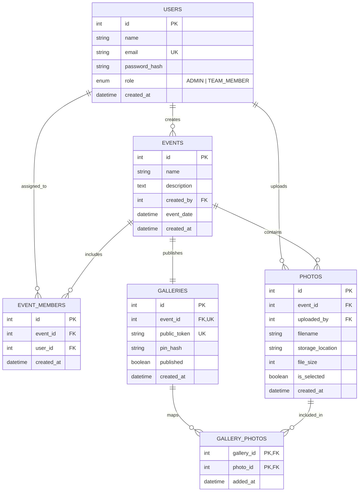

# 📸 PhotoShare — Production-Ready Photography Team & Client Gallery Platform

**PhotoShare** is a specialized, production-ready full-stack photography platform engineered for photography teams, studios, and their clients. It provides a seamless collaborative workflow:

$$\text{Admin creates Event} \longrightarrow \text{Assigns Team Members} \longrightarrow \text{Shooters Upload Photos} \longrightarrow \text{Admin Curates \& Selects} \longrightarrow \text{Publishes Private Gallery with PIN} \longrightarrow \text{Client Views Photos}$$

> 🔒 **Zero-Friction Client Experience**: Customers **never** need to create an account or remember passwords. They simply open their unique shareable link (e.g. `/gallery/abc123`), enter their secure 6-digit access PIN (e.g. `482917`), and browse their curated high-resolution photos in a responsive photography gallery.

---

## 🏗️ System Architecture

```
┌────────────────────────────────────────────────────────┐
│               React Frontend (Vite + Tailwind)         │
│  - Admin Studio Dashboard & Photo Curation Grid        │
│  - Team Multi-Photo Drag-and-Drop Batch Uploader       │
│  - Client Private Gallery Lightbox & Download Hub      │
└───────────────────────────┬────────────────────────────┘
                            │ REST API (JSON / Multipart)
                            │ Bearer JWT / Scoped Gallery Token
                            ▼
┌────────────────────────────────────────────────────────┐
│                 FastAPI Backend (Python)               │
│  - Role-Based Access Control (Admin vs Team Member)    │
│  - bcrypt Hashing (Passwords & Gallery PINs)           │
│  - Scoped Customer Gallery Session Generation          │
│  - Cloud Storage Adapter (Cloudinary / Local Fallback) │
└─────────────┬────────────────────────────┬─────────────┘
              │                            │
   SQLAlchemy │ ORM Metadata    Direct Upload │ / Storage URL
              ▼                            ▼
┌──────────────────────────┐  ┌──────────────────────────┐
│   PostgreSQL Database    │  │   Cloud Object Storage   │
│  - Users & Roles         │  │       (Cloudinary)       │
│  - Events & Memberships  │  │  - Raw & Optimized Images│
│  - Photo Metadata & Flag │  │  - High-Speed CDN URLs   │
│  - Galleries & PIN Hashes│  │  - Scalable Media Bucket │
└──────────────────────────┘  └──────────────────────────┘
```

---

## 🛠️ Technology Stack & Rationale

| Layer | Technology | Why It Was Chosen |
| :--- | :--- | :--- |
| **Frontend** | React 18 + Vite | Lightning-fast HMR, sub-second production builds, standard modern SPA ecosystem. |
| **Styling** | Tailwind CSS v4 | High-performance modern utility styling, elegant dark photography studio aesthetics. |
| **Routing** | React Router v7 | Declarative role-protected routes, parameter-based customer gallery links. |
| **HTTP Client**| Axios | Built-in request/response interceptors for seamless JWT attachment and error handling. |
| **Backend** | Python + FastAPI | Asynchronous performance, automatic OpenAPI `/docs` generation, strict Pydantic validation. |
| **ORM & DB** | SQLAlchemy 2.0 + PostgreSQL | Enterprise relational integrity, foreign key cascades, transaction safety, connection pooling. |
| **Auth & PIN** | JWT + bcrypt | Industry-standard password and gallery PIN encryption with zero plain-text storage. |
| **Storage** | Cloudinary / Local Fallback | Cloud-scale asset storage, transformation support, CDN delivery without bloating the database. |
| **Testing** | Pytest + TestClient | Automated coverage of authorization, role isolation, upload constraints, and PIN flows. |
| **Deployment**| Render | Blueprint-driven (`render.yaml`) deployment with automated PostgreSQL provisioning and HTTPS. |

---

## 👥 User Roles & Access Control

### 1. 🛡️ Admin / Lead Photographer
* Register & log in to the administrative command center.
* Create and manage photography projects/events.
* Assign and remove team members (second shooters, drone operators, assistants) to specific events.
* Review all photos uploaded across all shooters for any event.
* **Curate Deliverables**: Select/deselect photos individually or in bulk with live selection counter (e.g. `600 selected of 1250 uploaded`).
* Configure gallery access: generate unique public token and set a secure numeric/alphanumeric PIN.
* Publish/unpublish galleries and copy shareable client links.

### 2. 📷 Team Member / Second Shooter
* Log in and view **only** events they are assigned to.
* Batch upload multiple photos with drag-and-drop, progress tracking, and file validation.
* Inspect all photos within their assigned shoots and review their personal uploaded library (`/team/my-photos`).
* **Strictly Restricted**: Cannot access unassigned events, cannot publish galleries, cannot modify other users' photos, and cannot create events.

### 3. 🌟 Customer / Client
* **No registration or account creation required.**
* Receives a private gallery URL (`/gallery/{public_token}`) and 6-digit access PIN.
* Unlocks the gallery with their PIN. The backend validates the bcrypt hash and issues a scoped, time-limited gallery token.
* Browses responsive masonry grid, views full-resolution photos in a lightbox, and downloads images.
* **Strictly Restricted**: Cannot view unpublished galleries or unselected/raw photos.

---

## 🗄️ Database Architecture & Relationships



### Key Relational Constraints
* `users.email`: Unique index preventing duplicate accounts.
* `event_members`: Unique constraint on `(event_id, user_id)` preventing duplicate assignments.
* `galleries.event_id`: Unique foreign key ensuring one primary gallery per event.
* `galleries.public_token`: Unique index for URL generation (`/gallery/{token}`).
* `gallery_photos`: Composite primary key `(gallery_id, photo_id)` mapping curated photos to published galleries.
* **No Binary in DB**: Images are stored in Cloudinary; only the secure CDN URL and metadata (size, filename, dimensions) are recorded in PostgreSQL.

---

## 🔐 Security Architecture

### 1. Password & PIN Encryption
* Both user passwords and customer gallery PINs are encrypted using `bcrypt` (12 rounds of salt).
* PINs are never stored in plain text, logged, or returned in API responses.

### 2. Dual-Layer JWT Architecture
* **User Tokens**: Standard Bearer JWT tokens containing `sub: user_id`, `role: ADMIN | TEAM_MEMBER`, and 24-hour expiration.
* **Customer Gallery Session Tokens**: Scoped tokens generated **only** after entering the correct PIN for a specific gallery. These tokens contain `public_token` and `gallery_id`, preventing customers from tampering with URLs or inspecting unverified events.

### 3. Backend Authorization Enforcement
* Every endpoint verifies permissions on the server:
  * Team members querying an event ID verify membership via `db.query(EventMember)`.
  * Uploading photos validates that the authenticated shooter is assigned to the event.
  * Customer photo requests require a valid, non-expired customer session token matching the public token.

---

## 🚀 Live Demo Credentials

| Role | Email | Password | Access / Scope |
| :--- | :--- | :--- | :--- |
| **Admin / Lead** | `admin@photoshare.com` | `AdminPassword123!` | Full control, event creation, team assignment, photo curation, gallery publishing |
| **Team Member 1** | `sam@photoshare.com` | `TeamPassword123!` | Assigned to "Arjun & Priya Wedding", batch photo upload |
| **Team Member 2** | `elena@photoshare.com` | `TeamPassword123!` | Assigned to "Arjun & Priya Wedding", batch photo upload |
| **Customer Access**| *No account needed* | **PIN:** `482917` | **Demo Gallery URL**: `/gallery/abc123` |

---

## 💻 Local Quickstart Guide

### Prerequisites
* **Node.js** >= 18.0.0
* **Python** >= 3.10
* **Git**

### 1. Clone & Setup Backend
```bash
# Navigate to backend
cd backend

# Create virtual environment
python3 -m venv venv
source venv/bin/activate  # On Windows: venv\Scripts\activate

# Install dependencies
pip install -r requirements.txt

# Seed the database with demo users, sample event, photos, and published gallery
python seed_data.py

# Start FastAPI development server
uvicorn app.main:app --host 127.0.0.1 --port 8000 --reload
```
API Documentation will be live at: [http://localhost:8000/docs](http://localhost:8000/docs)

### 2. Setup Frontend
```bash
# In a new terminal, navigate to frontend
cd frontend

# Install dependencies
npm install

# Start Vite development server
npm run dev
```
PhotoShare Web Application will be live at: [http://localhost:5173](http://localhost:5173)

---

## 🧪 Automated Testing (Pytest)

PhotoShare includes an automated test suite verifying all 12 core requirements with an isolated in-memory test database:

```bash
cd backend
source venv/bin/activate
pytest -v tests/test_photoshare.py
```

### Verified Test Cases:
1. `test_admin_registration`: Admin registers, receives JWT and admin role.
2. `test_login`: User authentication generates valid access tokens.
3. `test_authentication`: Missing or invalid tokens return `401 Unauthorized`.
4. `test_role_authorization`: Non-admins attempting admin actions return `403 Forbidden`.
5. `test_team_member_event_access`: Assigned team members can access designated events.
6. `test_unauthorized_event_access`: Unassigned members are blocked from other shoots (`403 Forbidden`).
7. `test_photo_upload_authorization`: Assigned members upload successfully; outsiders are blocked.
8. `test_gallery_publishing`: Admin selects curated photos and publishes gallery with PIN.
9. `test_incorrect_gallery_pin`: Incorrect customer PIN returns `401 Unauthorized`.
10. `test_correct_gallery_pin`: Correct customer PIN issues scoped session token.
11. `test_customer_access_to_published_photos`: Verified customer retrieves published photos.
12. `test_customer_inability_to_access_unpublished_photos`: Unpublished galleries return `404` and unverified requests return `401`.

---

## 🌐 Cloudinary Cloud Storage Setup

1. Sign up for a free account at [Cloudinary.com](https://cloudinary.com).
2. Obtain your **Cloud Name**, **API Key**, and **API Secret** from the Cloudinary Console Dashboard.
3. Update `backend/.env`:
   ```env
   CLOUDINARY_CLOUD_NAME="your_cloud_name"
   CLOUDINARY_API_KEY="your_api_key"
   CLOUDINARY_API_SECRET="your_api_secret"
   ```
4. If credentials are left blank, PhotoShare automatically falls back to secure local file storage served via `/uploads`, allowing development and offline testing without cloud credentials.

---

## ☁️ Deployment Instructions (Render)

PhotoShare includes a ready-to-deploy `render.yaml` blueprint.

### One-Click Blueprint Deployment:
1. Push this repository to GitHub.
2. Go to the [Render Dashboard](https://dashboard.render.com).
3. Click **New +** → **Blueprint**.
4. Connect your GitHub repository.
5. Render will automatically detect `render.yaml` and provision:
   * **`photoshare-db`**: Free Managed PostgreSQL Instance.
   * **`photoshare-backend`**: Python FastAPI Web Service.
   * **`photoshare-frontend`**: Static Site hosting the compiled React + Vite bundle with client-side SPA routing.
6. In the Render Dashboard under `photoshare-backend`, add your Cloudinary environment variables (`CLOUDINARY_CLOUD_NAME`, `CLOUDINARY_API_KEY`, `CLOUDINARY_API_SECRET`).
7. Once deployment finishes, access your live URL!

---

## 📮 API Endpoints Reference

### Authentication
* `POST /api/auth/register` — Register Admin or Team Member.
* `POST /api/auth/login` — Authenticate and receive JWT Bearer token.
* `GET /api/auth/me` — Retrieve current authenticated user profile.
* `GET /api/auth/users` — Admin lists team members to assign to events.

### Events
* `POST /api/events` — Admin creates a new photography event.
* `GET /api/events` — List events (Admin views all; Team Members view assigned).
* `GET /api/events/{id}` — Retrieve event details and metrics.
* `PUT /api/events/{id}` — Admin updates event info.
* `DELETE /api/events/{id}` — Admin deletes event and associated media.
* `POST /api/events/{id}/members` — Admin assigns a team member.
* `GET /api/events/{id}/members` — View assigned shooters.
* `DELETE /api/events/{id}/members/{user_id}` — Admin unassigns a member.

### Photos
* `POST /api/events/{id}/photos` — Multi-photo batch upload (Assigned shooter or Admin).
* `GET /api/events/{id}/photos` — View all photos uploaded to the event.
* `GET /api/photos/my` — Team member views their own uploaded portfolio.
* `PUT /api/events/{id}/photos/selection` — Admin curates/selects photos for customer delivery.
* `DELETE /api/photos/{id}` — Delete photo (Admin or uploading shooter).

### Galleries & Customer Access
* `POST /api/events/{id}/gallery` — Admin configures gallery and sets bcrypt PIN.
* `POST /api/galleries/{id}/publish` — Admin toggles publishing state (syncs selected photos).
* `GET /api/galleries/{id}` — Admin inspects gallery status and shareable link.
* `GET /api/gallery/{token}/info` — Customer checks public event title before entering PIN.
* `POST /api/gallery/{token}/verify` — Customer enters PIN; receives scoped session token.
* `GET /api/gallery/{token}/photos` — Customer retrieves curated published photos.

---

## ⚠️ Known Limitations
* **Direct RAW File Support**: Currently supports standard web-deliverable image formats (JPEG, PNG, WebP, GIF up to 25MB per file). Proprietary camera RAW files (.CR3, .ARW, .NEF) should be converted to high-res JPEG/WebP prior to client gallery delivery.
* **Storage Provider**: Primary cloud storage configured for Cloudinary; S3 adapter can be added by implementing the storage interface.
